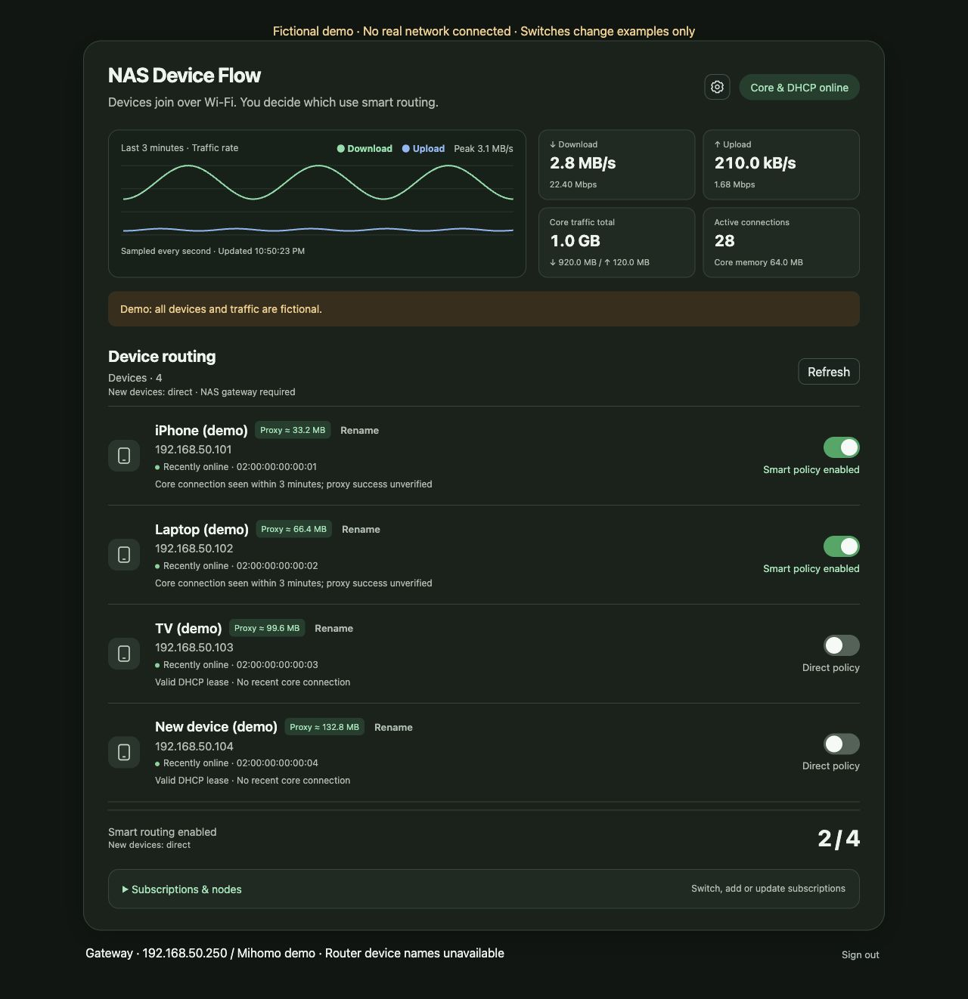

# 🧭 NAS Device Flow

**Per-device smart routing for your home network.**

English · [🌐 简体中文](README.zh-CN.md) · [Installation guide](docs/installation.en.md) · [Releases](https://github.com/AzBuildDev/nas-device-flow/releases)

Give each device a direct or smart-routing switch. See its proxy traffic, manage subscriptions, and keep everyday controls in one small web panel.

After DHCP setup, clients can join Wi-Fi with automatic IP and DNS. The panel runs on your Linux NAS alongside Mihomo; both services are defined in the same Docker Compose file.


## ✨ What you can do

- **Control each device.** Choose direct access or smart routing, with preferences retained while its MAC stays the same.
- **See network activity.** Live upload/download rates, a traffic chart, active connections and sampled proxy usage per device.
- **Manage subscriptions.** Add, switch and refresh Clash/Mihomo YAML subscriptions.
- **Choose your defaults.** A settings gear holds Chinese, English, Japanese, Spanish and French selection, the new-device default policy, admin password changes and connection details.
- **Choose your appearance.** System, light or dark mode in Settings, remembered in your browser. Charts follow the theme.
- **Find your devices.** DHCP, neighbor records and mDNS provide discovery and names. Optional router adapters can add device information.

New devices default to direct access. You can change this to smart routing in Settings; existing switches stay unchanged. A changed private MAC counts as a new device and follows that default, even if its name is familiar.

All five interface languages ship in one package. The initial language follows the browser, including regional variants; unsupported languages fall back to English. Manual language selection is saved in your browser. Routing rules and DNS are configured separately: the initial China-direct / other-destinations-proxy rules reflect the original mainland-China setup.



## 👀 Try the demo

```sh
python3 scripts/demo.py
```

Open http://127.0.0.1:9088/. Devices and traffic are fictional. The demo does not read deployment credentials or change your network.

## 🚀 Install through the NAS GUI

Use the [browser installer](docs/nas-gui-install.md). No AI connection to the NAS, SSH, host Python or JSON editing is required.

1. Create a NAS installation folder and import [setup.compose.yaml](setup.compose.yaml) in the Docker project interface. Edit only the folder path at the top.
2. Start setup, copy the access code from container logs and open `http://NAS-IPv4-address:9088`.
3. Confirm interfaces, addresses, password and subscription in the wizard. Download its production Compose file.
4. Stop setup, import the downloaded file and start production. Both the panel and Mihomo are included.
5. Test one client, disable router DHCP, then enable automatic joining in panel Settings → Network & stats.

The image targets x86-64 Linux NAS systems with Compose project support, wired macvlan and TUN. Existing state is never overwritten; DHCP starts OFF. See [manual installation](docs/nas-gui-install.md) for requirements and vendor path examples.

SSH users can run `sh scripts/install.sh --lang en` in the source directory. Docker runs the interactive wizard, with no host Python requirement. Use `--check` for environment/interface checks, `--prepare-only` to save configuration without starting services and `--start` to retry startup. The original JSON initialization path remains in the [advanced installation guide](docs/installation.en.md).

macOS, Windows, phones and tablets use the browser as clients; the gateway runs on Linux. [Docker platform documentation](https://docs.docker.com/engine/network/drivers/macvlan/)

## 🧪 Project status

This is an experimental prerelease. The original setup is running on a UGREEN DXP4800 with UGOS Pro, a bonded interface and a Huawei TC7102. Source tests and isolated container/DHCP checks cover the generalized package; a fresh networked installation on another LAN still needs validation. OpenWrt and MikroTik device-name adapters have mock tests only.

A switch means a policy is configured. It does not prove the client is using the NAS gateway or that a website is reachable. See [connection diagnostics](docs/diagnostics.md) and [compatibility notes](docs/compatibility.md).

IPv4 only, with no automatic failover if the NAS stops. Public IPv6 can bypass IPv4 rules. Keep the panel and core API on your LAN.

Traffic uses decimal units: 1 MB = 1,000,000 bytes. Per-device totals are sampled, persisted estimates, not subscription billing. Charts describe traffic through Mihomo, not all LAN traffic. See [metric definitions](docs/metrics.md).

## 🤝 Contribute

```sh
.venv/bin/python -m unittest discover -s tests -v
```

[Report an issue](https://github.com/AzBuildDev/nas-device-flow/issues) with your NAS, Linux, Docker and router versions. Use fictional IP/MAC examples and redact credentials and logs. Hardware compatibility reports are welcome; distinguish real-device results from mocks.

[Contributing](CONTRIBUTING.md) · [Security](SECURITY.md) · [Release checks](docs/release-readiness.md)

Our controller and web panel use the [MIT license](LICENSE). Mihomo and system packages retain their own licenses; see [third-party notices](THIRD_PARTY_NOTICES.md). This project is independent of OpenClash, UGREEN and router vendors.
