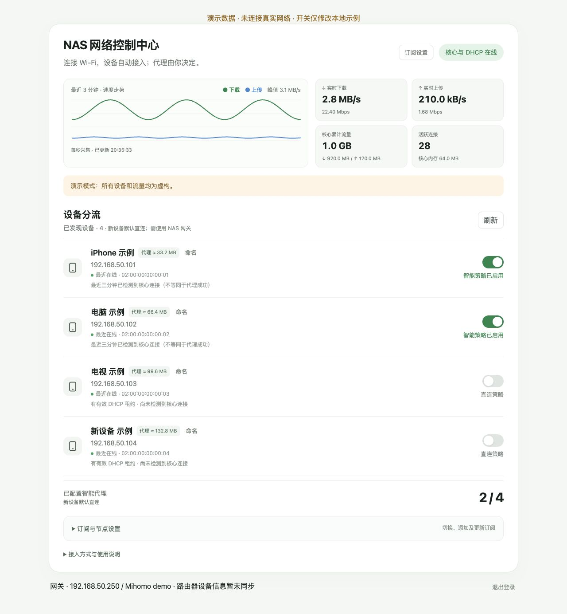

# NAS Device Flow

在网页中为每台设备打开或关闭智能分流。设备离开再回来，MAC 不变时保留开关；新设备默认直连。

版本：0.1.0-rc.2（预发布）。[English](README.en.md)



本地演示：`python3 scripts/demo.py`，打开 http://127.0.0.1:9088/。仅修改示例，不读取部署凭据。

## 能做什么

- 自动收集 DHCP、邻居和 mDNS 设备信息，支持手动命名。
- 按设备启用国内直连、其他流量按订阅规则代理。设备开关优先显示。
- 展示核心实时上下行、连接数、趋势图，以及每台设备采样累计的代理流量。
- 添加、切换和更新 Clash/Mihomo YAML 订阅，切换失败尝试恢复配置。

这是控制面板加 Mihomo 的 Linux Docker 部署方案。与 OpenClash、官方绿联软件及路由器厂商没有隶属关系。路由器型号识别取决于适配器返回的信息，不能保证识别所有设备。

## 部署

需要 Linux NAS、Docker Compose、可用 macvlan 的有线接口，以及可设置 DHCP 的主路由。所有客户端与 NAS 处于同一局域网。

```sh
python3 -m venv .venv
.venv/bin/pip install -r requirements.txt
cp examples/settings.json config.local.json
# 编辑 config.local.json：网段、上级网关、空闲核心/面板 IP、基础设施和 DHCP 地址池
.venv/bin/python scripts/initialize.py --settings config.local.json --parent eth0
docker compose config --quiet
docker compose up -d --build
```

初始化会交互读取新面板密码与订阅，生成私有 runtime 和 .env，不启动 DHCP。先按[部署说明](docs/installation.md)用一台测试设备验收，再切换 DHCP。不要直接在现有网络上照抄示例 IP。

无需 macOS 或 Windows 客户端，设备通过浏览器管理。Docker Desktop 的 macvlan 不支持这两种系统，第一版只提供 Linux 服务端。[Docker 平台说明](https://docs.docker.com/engine/network/drivers/macvlan/)

## 验证范围

原运行版已在绿联 DXP4800、UGOS Pro、聚合网口和华为 AX3 环境使用。发布候选的通用初始化与 Compose 需要新环境试装验收，不能把原运行环境验证等同于所有 NAS 兼容。

华为适配器针对已验证固件；OpenWrt ubus 和 MikroTik REST 仅有模拟测试，默认关闭路由器适配器。见[兼容说明](docs/compatibility.md)。

## 数据含义

MB 使用十进制换算，1 MB = 1,000,000 字节。核心累计在核心重启后归零。设备代理流量从首次启用采样开始，保存到 runtime；短连接和停机期间可能漏计，仅供观察。图表统计经过核心的直连和代理流量，不能代表全局域网吞吐或套餐带宽。[详细说明](docs/metrics.md)

```sh
.venv/bin/python -m unittest discover -s tests -v
```

[贡献指南](CONTRIBUTING.md) · [安全边界](SECURITY.md) · [发布检查](docs/release-readiness.md)

## 许可证

自己的面板代码采用 MIT，见 LICENSE。Mihomo、dnsmasq、PyYAML 等依赖保留各自许可，见 THIRD_PARTY_NOTICES.md。

开关开启表示策略已配置，不代表设备已接入或网站必然可访问。只有实际使用 NAS 核心网关/DNS 的客户端才受控；多网卡电脑需核对当前出网接口。见[接入诊断](docs/diagnostics.md)。

自动网络接入与设备身份分开：设备 IP/DNS 可保持自动，MAC 不变时保留策略；私人 MAC 改变会出现新设备，默认直连，不根据同名自动继承代理。
