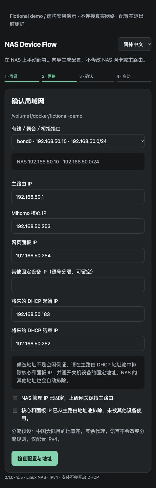

# 在 NAS 界面中手动安装

[English](nas-gui-install.md) · 简体中文

这条流程不需要 AI 连接 NAS，也不需要 SSH、Python、修改 JSON 或在 NAS 上构建镜像。你在 NAS 的 Docker 管理界面启动安装项目，用浏览器生成配置，再导入正式项目。

当前发布镜像面向 x86-64 Linux NAS。需要 Docker Compose 项目功能、host 和 macvlan 网络、`/dev/net/tun`，以及可关闭 DHCP 的主路由。NAS 与客户端在同一局域网。其他 NAS 是否满足这些条件需要自行确认；不能把支持 Compose 等同于已实机兼容。

## 1. 准备一个安装文件夹

在 NAS 文件管理中创建并保留一个文件夹。绿联可使用 `/volume1/docker/nas-device-flow`，但以你的实际存储卷路径为准。群晖常见路径是 `/volume1/docker/...`，威联通可能使用 `/share/Container/...`；这些是路径示例，不是实机验证记录。

确认 NAS 管理 IP 固定，上级网关仍为主路由。保留现有聚合接口，不需要解除聚合或重建 LinuxBridge。

备份主路由 DHCP 设置。检查 LAN 公网 IPv6/RA；本项目仅配置 IPv4，公网 IPv6 需要关闭或另行接管。

## 2. 在 Docker 中启动安装项目

下载发布版本中的 `setup.compose.yaml`。在 NAS 的 Docker 管理应用中创建 Compose 项目，导入该文件或粘贴内容。项目名称使用 `nas-device-flow-setup`。

只需把文件顶部这一行改成第 1 步创建的文件夹绝对路径：

```yaml
x-project-path: &project-path /volume1/docker/nas-device-flow
```

这是 Docker 宿主机路径，不是电脑下载文件夹、SMB 地址或 NAS 网页链接。保持 YAML 中的 `&project-path` 与 `*project-path` 原样，下面的挂载和路径配置会使用同一值。

绿联 UGOS Pro 的入口是「Docker → 项目 → 创建」。填写项目名称和存放路径，在「Compose配置 → 导入 → 从本地电脑导入」选择文件，也可直接粘贴 YAML；勾选创建完成后运行，再点击「立即部署」。本次已核对这些界面字段，其他系统按其 Compose 项目入口操作。

启动项目，等待镜像下载。也可先下载发布页中的 `controller-amd64.tar.gz` 镜像压缩包，先上传到 NAS，再在绿联 Docker 的「镜像 → 本地镜像 → 添加镜像 → 从 NAS 导入」选择该文件；这适合 NAS 无法访问 GHCR 的情况，不需要构建镜像。Mihomo 镜像仍需要从 Docker Hub 下载。若 NAS 的 9088 端口已被使用，修改 `NDF_SETUP_PORT` 后再启动，浏览器也使用新的端口。首次安装需要能下载 GHCR 的面板镜像和 Docker Hub 的 Mihomo 镜像。

在 Docker 中查看 `setup` 容器的日志，复制 `Setup access code / 安装访问码`。该码只用于临时安装向导，每次重启安装容器都会更新；面板管理密码由你在后面设置。

## 3. 在浏览器填写向导

打开 `http://NAS的IPv4地址:9088`，输入安装访问码。必须使用 NAS 的数字 IPv4 地址；安装入口暂不支持自定义域名或 HTTPS 反向代理。向导可切换中文和英语。



选择有线、聚合或桥接接口。向导读取实际网段、NAS 地址及默认网关，提供两个候选 IP 和将来的 DHCP 地址池。

核对以下内容：

- 主路由 IP 正确。
- 核心和面板使用两个不同的空闲固定 IP。在主路由 DHCP 地址池中排除它们。ARP 检查可以发现响应的设备，但无法证明关机设备或旧 DHCP 分配不会冲突。
- 填写其他固定设备地址，避免未来 NAS DHCP 地址池分配这些地址。NAS 在本网段的各个地址会自动排除。
- NAS 管理地址固定，并保留主路由作为网关。

点击检查。如果地址占用，换一个地址；如果 ARP 检查无法完成，需要先在主路由和静态设备配置中人工确认未占用，再勾选额外确认。

设置独立的面板密码，长度 16–256 个字符，首尾不留空格。输入 Clash/Mihomo YAML 订阅 URL。Base64 通用节点订阅不能直接代替 YAML provider。当前预设来自中国大陆网络场景，海外使用者需要另行调整分流规则及 DNS。

点击保存。向导在 NAS 文件夹中生成私有 `runtime`、`.env` 和 `deployment.compose.yaml`。已有运行配置不会被覆盖，DHCP 保持关闭。失败或中断后先重新打开向导查看是否已保存，不要删除 runtime 后重新试。

## 4. 启动正式项目

下载向导给出的 `deployment.compose.yaml`，在 NAS Docker 界面停止安装项目。不要删除安装文件夹或勾选删除挂载数据。

创建正式 Compose 项目 `nas-device-flow`，导入下载的文件并启动。它包含面板和 Mihomo，使用绝对挂载路径，没有需要编辑的环境变量，也不需要单独部署 OpenClash。

用另一台局域网设备打开向导显示的面板地址并登录。面板使用独立 IP，通常不是 `NAS的IP:9080`。NAS 宿主机与 macvlan 容器直接通信受 Linux 限制，不能只用 NAS 上的浏览器判定是否可访问。[Docker 平台说明](https://docs.docker.com/engine/network/drivers/macvlan/)

等待核心、订阅和规则数据加载。核心连通不代表节点可用，仍要完成下一步。

## 5. 测试后启用自动接入

先对一台设备设置本网段空闲 IP，将网关和 DNS 指向向导中的核心 IP。关闭其本机 VPN 和系统代理，在面板中分别测试直连与智能分流，并验证实际网页可达。

测试通过后关闭主路由和其他 DHCP。在面板「设置 → 接入与统计 → 自动接入设置」确认三个条件并点击「开启自动接入」。不需要进入容器终端。程序检查核心可连接，但不能替你证明主路由已关闭 DHCP 或网页可正常访问。

客户端恢复自动 IP/DNS，更新租约，确认网关和 DNS 都是核心 IP。如果重连仍保留旧租约，可以忽略 Wi-Fi 后重新输入密码加入。之后设备只需连接 Wi-Fi，代理开关由面板控制。

## 停用与更新

停用时，先在面板点击「停止 NAS DHCP」，等待至少 3 秒并确认停止，再开启主路由 DHCP，让客户端更新租约，最后停正式项目。原来手工设置的设备恢复自动 IP/DNS。NAS 无法访问时，先给管理设备设置主路由网关/DNS，恢复主路由 DHCP；当前没有自动网关故障切换。

更新前私下备份原安装文件夹。GUI 安装无需重新运行向导：按新版本的升级说明更新正式项目镜像引用，保留原地址、网络与 runtime 挂载。不要用安装向导覆盖已有部署，也不要直接拿另一台设备生成的 YAML 替换自己的配置。

文件夹中的密码、订阅和设备记录不要发给他人或上传 GitHub。提交问题时附 NAS 型号、系统及 Docker 版本，去掉凭据、真实 IP/MAC 和敏感日志。

## 常见卡点

| 现象 | 检查位置 |
| --- | --- |
| 找不到 Compose 项目入口 | NAS 容器应用版本及项目功能；不支持时使用终端安装方式 |
| 镜像下载失败 | NAS 到 GHCR/Docker Hub 的网络；没有镜像时向导不会启动 |
| 安装网页打不开 | setup 容器是否运行、端口是否冲突、NAS 防火墙；使用 NAS 数字 IPv4 地址 |
| 未发现可用网卡 | 有线连接、host 网络、私有 IPv4 的 /22–/29 网段；无线和隧道接口不列为候选 |
| 正式容器启动失败 | 两个容器日志、macvlan 接口、TUN 支持、固定 IP 冲突 |
| 面板能打开但开关不控制设备 | 客户端实际网关/DNS、旧 DHCP 租约、VPN/系统代理及 IPv6 |

已验证情况见[发布验收](release-readiness.md)。绿联之外的 NAS 尚未完成实机手动安装验收。
